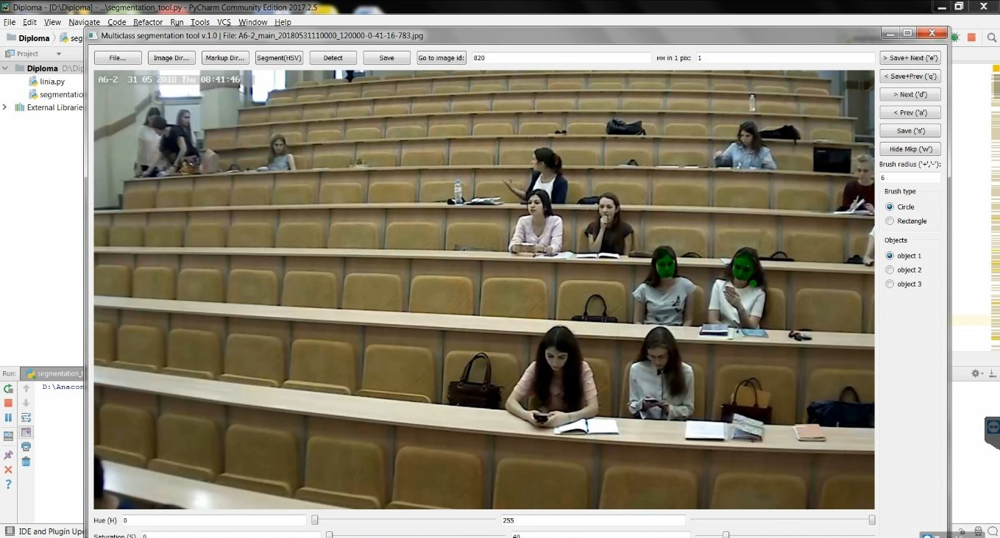

## Инструмент сегментации с графическим интерфейсом на основе pyQT5 и OpenCV для Python 3

Для удобства запуска примеров, советуем установить на свой ПК пакеты Anaconda и PyCharm.
[Ссылка на статью с подробным описанием](https://devpractice.ru/python-lesson-1-install/).

В проекте используются: язык python3.х, библиотеки [pyQT5](https://pythonworld.ru/gui/pyqt5-firstprograms.html), [scikit-image](http://scikit-image.org), [opencv 3](https://opencv.org/opencv-3-0.html), [NumPy](https://pypi.org/project/numpy/).

--------------------------------------

**Для корректной работоспособности программы segmentation_tool.py нужно проделать следующие шаги (для Windows):**

Создать зависимости между **Python3**, **pyQT5**, пакетом **scikit-image** и **OpenCV 3**.

**1.1** Нажать комбинацию клавиш **Win+R**, в появившемся окне ввести команду _cmd_ (вызвать командную строку)

**1.2** Создать среду python 35 командой:  

	conda create –n python35 python=3.5 anaconda
    
**1.3** Активировать среду python 35 командой:

	activate python 35

**1.4** Теперь можно проверить версию языка python при помощи команды 

	python --version

**1.5** Теперь нужно установить необходимые для работы библиотеки:

OpenCV:

	conda install -c conda-forge opencv

scikit-image:

	pip install scikit-image **или** conda install -c conda-forge scikit-image

NumPy:

	pip install numpy

pyQT5: [ссылка на официальный сайт.](https://riverbankcomputing.com/software/pyqt/download5)

------------------------------------------------------------------------

Далее нужно **клонировать файлы с [репозитория](https://github.com/yuddim/multi_class_segmentation_tool)** и запустить программу в **PyCharm**. 

**Пример работы программы:**

----------------------------------
[Видео, иллюстрирующее работу с программой](https://www.youtube.com/watch?v=bjM5I21gQFw)

